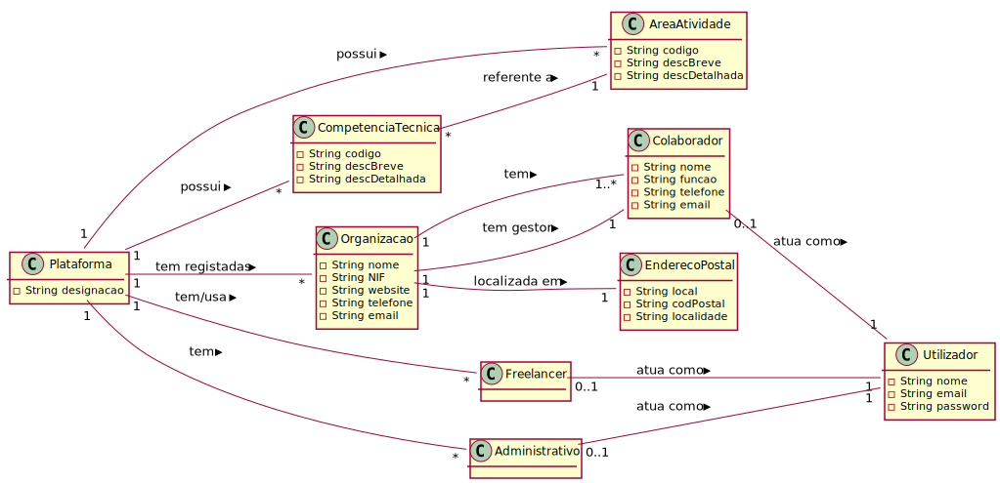

# Análise OO #
O processo de construção do modelo de domínio é baseado nos casos de uso, em especial os substantivos utilizados, e na descrição do enunciado.
## Racional para identificação de classes de domínio ##
Para a identificação de classes de domínio usa-se a lista de categorias das aulas TP (sugeridas no livro). Como resultado temos a seguinte tabela de conceitos (ou classes, mas não de software) por categoria.

### _Lista de Categorias_ ###

**Transações (do negócio)**

*

---

**Linhas de transações**

*

---

**Produtos ou serviços relacionados com transações**

*  

---

**Registos (de transações)**

*  

---  

**Papéis das pessoas**

* Administrativo
* Freelancer
* Colaborador (de Organização)
* Gestor (de Organizacao)
* Utilizador
* Utilizador Não Registado

---

**Lugares**

*  Endereço Postal

---

**Eventos**

* 

---

**Objectos físicos**

*

---

**Especificações e descrições**

*  Área de Atividade
*  Competência Técnica

---

**Catálogos**

*  

---

**Conjuntos**

*  

---

**Elementos de Conjuntos**

*  

---

**Organizações**

*  T4J (Plataforma)
*  Organização

---

**Outros sistemas (externos)**

*  (Componente Gestão Utilizadores)

---

**Registos (financeiros), de trabalho, contractos, documentos legais**

* 

---

**Instrumentos financeiros**

*  

---

**Documentos referidos/para executar as tarefas/**

* 
---

###**Racional sobre identificação de associações entre classes**###

Uma associação é uma relação entre instâncias de objectos que indica uma conexão relevante e que vale a pena recordar, ou é derivável da Lista de Associações Comuns:

+ A é fisicamente (ou logicamente) parte de B
+ A está fisicamente (ou logicamente) contido em B
+ A é uma descrição de B
+ A é conhecido/capturado/registado por B
+ A usa ou gere B
+ A está relacionado com uma transacção de B
+ etc.

| Conceito (A) 		|  Associação   		|  Conceito (B) |
|----------	   		|:-------------:		|------:       |
| Administrativo  	| define    		 	| Área de Atividade  |
|   					| define            | Competência Técnica  |
|   					| trabalha para     | Plataforma  |
|						| atua como			| Utilizador |
| Plataforma			| tem registadas    | Organização  |
|						| tem     			| Freelancer  |
|						| tem     			| Administrativo  |
| 						| possui     			| Competência Técnica  |
| 						| possui     			| Área de Atividade  |
| CompetênciaTécnica| referente a       | Área de Atividade  |
| Organizacao			| possui      	   | EndereçoPostal  |
|						| tem gestor     	| Colaborador |
|						| tem		     		| Colaborador |
| Gestor (de Organização)| é um (papel de)| Colaborador |
| Freelancer			| atua como			| Utilizador |
| Colaborador			| atua como			| Utilizador |

## Modelo de Domínio

