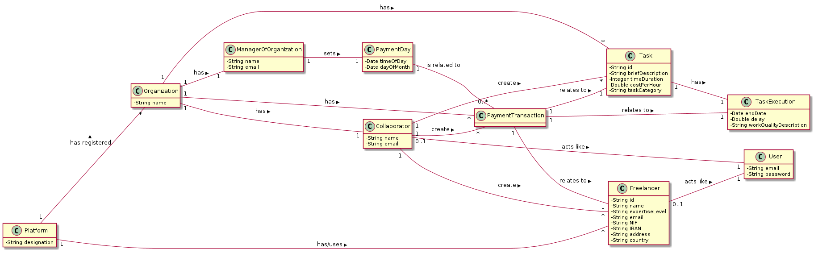

# OO Analysis #
The domain model construction process is based on use cases, in particular the nouns used, and the description of the assignment.
## Rational for identifying domain classes ##
For the identification of domain classes, the list of categories of TP classes (suggested in the book) is used. As a result we have the following table of concepts (or classes, but not software) by category.

### _Category List_ ###

**Transactions (business)**

---

**Transaction lines**

---

**Transaction-related products or services**

---

**Records (of transactions)**

---

**People's roles**

---

**Places**

---

**Events**

---

**Physical objects**

---

**Specifications and descriptions**

---

**Catalogs**

---

**Set Elements**

---

**Organizations**

---

**Other (external) systems**

---

**Records (financial), work, contracts, legal documents**

---

**Financial instruments**

---

**Referred documents / to perform the tasks /**

---

## **Rational about identifying associations between classes** ##

## Domain Model

