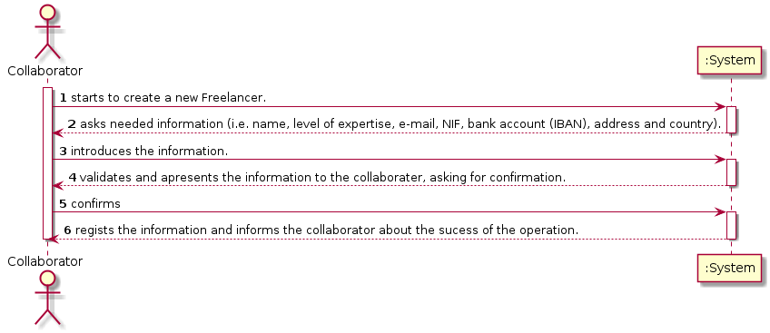
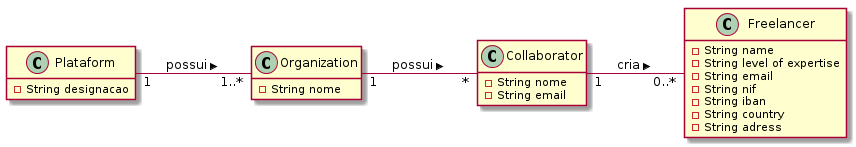
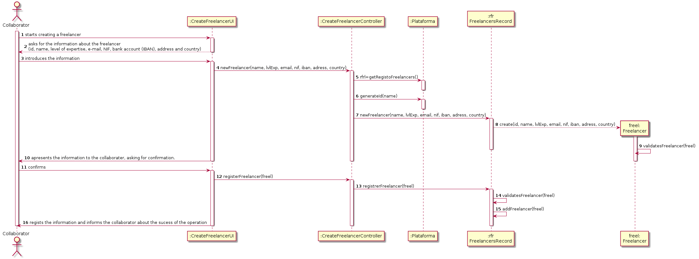
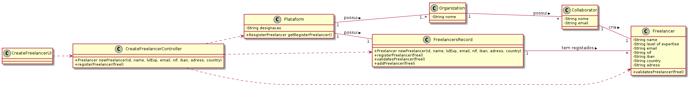

UC1 - Create Freelancer

## 1. Requirements engineering

### Breef Format

The collaborator starts to create a new Freelancer. The system asks needed information (i.e. id, name, level of expertise, e-mail, NIF, bank account (IBAN), address and country). The collaborator introduces the information. The system validates and apresents the information to the collaborater, asking for confirmation. The collaborator confirms. The system regists the information and informs the collaborator about the sucess of the operation.

### SSD

### Full Format

#### Main Actor

* Collaborator

#### Interested parts and his interest
* **Collaborator:** pretends to create a new freelancer for a task.
* **T4J:** pretends the collaborator associats a new freelancer to a task.
* **Freelancer:** pretends to be registed in the system.

#### Conditions before
/-

#### Conditions after
The freelancer stays in the system.

### Main sucess scene (Basic flux)

1. The collaborator starts to create a new Freelancer. 
2. The system asks needed information (i.e. name, level of expertise, e-mail, NIF, bank account (IBAN), address and country). 
3. The collaborator introduces the information. 
4.The system validates and apresents the information to the collaborater, asking for confirmation. 
5. The collaborator confirms. 
6. The system regists the information and informs the collaborator about the sucess of the operation.

#### Extensions (or alternative fluxes)

*a. The collaborator cancels the registration

> Case of use ends.

4a. Minimal information missing.
>       1. The system informs which information is missing.
>       2. The system allows introducing the missing information (step 3)
>
        >       2a. The collaborator doesn´t add information. The case of use ends.

4b. The systems detects the information (or any amount of information) introduces must be unique and already exists in the system.
>       1. The system alerts the collaborator for the fact.
>       2. The system allows the changing (step 3).
>               
        >2a. The collaborator does not change anything. The use case.

4c. The system detects the information introduced (or any amount of information) are invalid.
>       1. The system alerts the collaborator for the fact.
>       2. The system allows the changing (step 3).
>
        > 2a. The collaborator does not change anything. The use case.

      
#### Special Requirements
\-

#### List of Technologies and Data Variations
\-

#### Frequency of Occurrence
\-

#### Open Questions

* Exists other data needed?
* Are all data mandatory?
* How frequently this use case occurs?

## 2. OO Analysis

### Excerpt from the Relevant Domain Model for UC

 

## 3. Design - Realization of Use Case

### Racional

| Main Flow | Question: Which class... | Answer | Justification |
|:--------------  |:---------------------- |:----------|:---------------------------- |
| 1. The collaborator starts to create a new Freelancer. | ...interacts with the user? | CreateFreelancerUI | Pure Fabrication: does not justify gice this responsability in any class that exists in the MD | 
|                                                        | ...coordinates the UC? | CreateFreelancerController | Controller |
|                                                        | ...creates the instance Freelancer? | RegisterFreelancer | HC+LC + Creator |
|                                                        | ...knows RegisterFreelancer? | Plataform | HC+LC |
| 2. The system asks needed information (i.e. name, level of expertise, e-mail, NIF, bank account (IBAN), address and country). |  |  |  |  
| 3. The collaborator introduces the information. | ...keeps the information? | Freelancer | IE: Knows his own information | 
|                                                 | ...generates the id for each freelancer? | Freelancer | IE: Knows his own information. |
| 4. The system validates and apresents the information to the collaborater, asking for confirmation. | ...validates the information?(local)? | Freelancer  | IE: Knows his own information |  
|                                                                                                     | ...validates the information(global)? | RegisterFreelancer | HC+LC |                                        
| 5. The collaborator confirms. |  |  |  | 
| 6. The system regists the information and informs the collaborator about the sucess of the operation. | ...keeps the freelancer created? | RegisterFreelancer | HC+LC: Plataform delegated functions  |
|                                                                                                       | ...informs the collaborator? | CreaterFreelancerUI | Pure Fabrication |

### Systematization ##

 From the racional results the conceptual classes promoted to software classes are : 
 
 * Plataform
 * Freelancer

 The other software classes (i.e. Pure Fabrication) identify:

 * CreateFreelancerUI
 * CreateFreelancerController 
 * FreelancerRecord 

###     Sequence Diagram
 

###     Class Diagram

