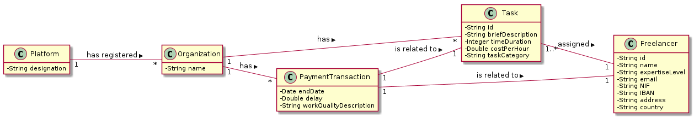
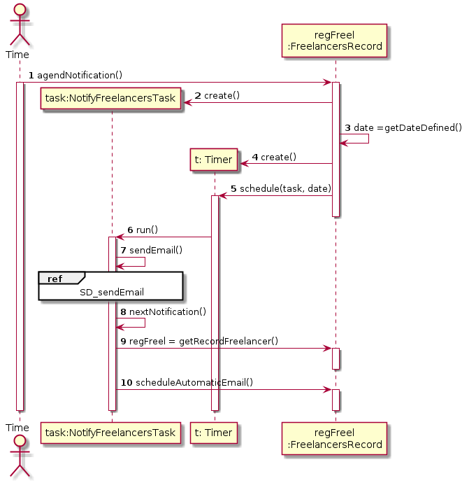
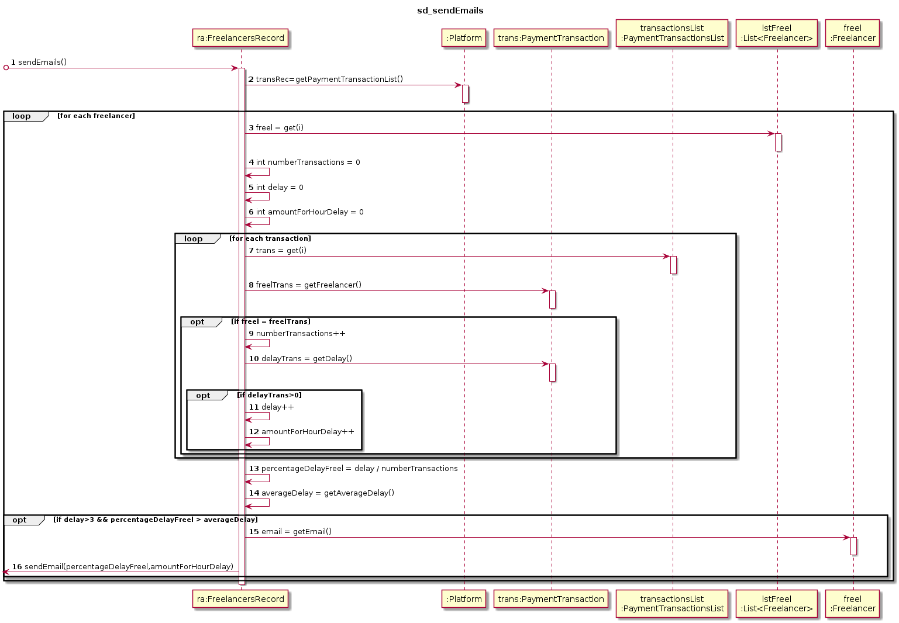

# UC10 - Notify Delayed Freelancers (automatically)

## 1. Requirements Engineering

### Breef Format

The system inicializes the process of notification in the last day of each year. The system **register the data** and ends the process.

### SSD

### Full Format

#### Main Actor

* Timer

#### Interested parts and his interest
* **T4J:** wants that the Freelancer stays informed by the system.
* **Freelancer:** gets informed by the system.

#### Conditions before
/-

#### Conditions after
The freelancer stays informed.

### Main sucess scene (Basic flux)

1. The system starts the process of notification in the last day of every year.
2. The system identifies the freelancers that have mean task delay higher than 3 hours and have a percentage of delays higher than the overall percentage of delays. After that, starts the notification of the freelancers.

#### Extensions (or alternative fluxes)

*2a. There are no freelancers.
> Use case ends.

*2b. The freelancers have no task delay.
> Use case ends.

*2c. There is no freelancer that has task delay time higher than 3 hours
> Use case ends.
      
#### Special Requirements
\-

#### List of Technologies and Data Variations
\-

#### Frequency of Occurrence
\-

#### Open Questions

* Exists other data needed?
* Are all data mandatory?
* How frequently this use case occurs?

## 2. OO Analysis

### Excerpt from the Relevant Domain Model for UC

 

## 3. Design - Realization of Use Case

### Racional

| Main Flow | Question: Which class... | Answer | Justification |
|:--------------  |:---------------------- |:----------|:---------------------------- |
| 1. The system initializes the process of notifying the freelancers. | ...coordinates the UC? | NotifyFreelancersTask | Task |
|                                                        | ...starts the process of notification? | Timer | Timer |
|                                                        | ...creates the instance Timer? | Platform | Creator: Plataform as knowledge of the time to start the notifications. |
| 2. The system identifies the freelancers that have mean task delay higher than 3 hours and have a percentage of delays higher than the overall percentage of delays. After that, starts the notification of the freelancers. | ...knows FreelancerRecord? | Plataform | IE: Plataform contains RecordFreelancer (HC + LC) |
|  | ...knows the PaymentTransactionList? | Platform | IE : in the MD Platform has Organization |
|  | ...knows the each payment transaction? | PaymentTransactionList | IE: Owns the class PaymentTransaction (HC + LC) |
|  | ...knows the task delay? | PaymentTransaction | IE: Knows its own information |  
|  | ...knows the percentage of delays? | PaymentTransaction | IE: knows its own information  |
|  | ...know the freelancers? | FreelancersRecord | IE: Owns the class Freelancers (HC + LC) |
|  | ...knows all the payments | PaymentTransactionList | IE : In the MD PaymentTransactionList has Freelancer |
|  | ...knows the freelancer´s email? | Freelancer | IE: Owns his data |
|  | ...schedules the next year´s notification? | FreelaNcerRecord | IE: Owns his information |

### Systematization ##

 From the racional results the conceptual classes promoted to software classes are : 
 
 * Platform
 * PaymentTransaction
 * Organization
 * Freelancer

 The other software classes (i.e. Pure Fabrication) identify:

 * NotifyFreelancersTask
 * Timer
 * FreelancerRecord
 * PaymentTransactionList

###     Sequence Diagram
 

###     Class Diagram

