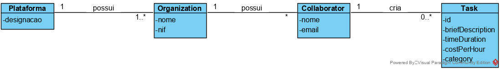
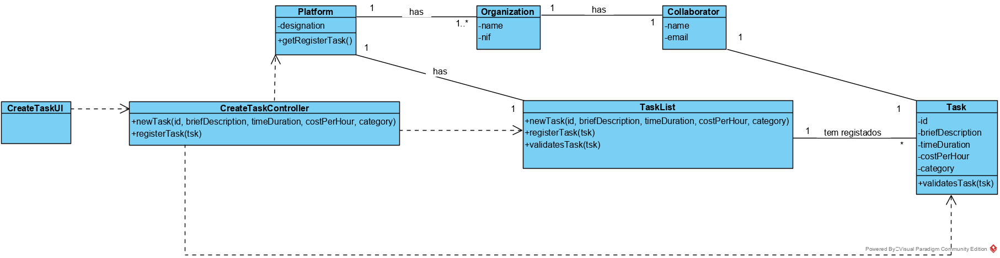

UC2 - Create Task

## 1. Requirements engineering

### Brief Format

The collaborator starts to create a new Task.
The system asks needed information (i.e. id, brief description, time duration, cost per hour, category).
The collaborator inputs the information.
The system validates and displays the information to the collaborater, asking for confirmation.
The collaborator confirms.
The system regists the information and informs the collaborator about the success of the operation.

### SSD

### Full Format

#### Main Actor

Collaborator

#### Interested Parts and their intentions
* **Collaborator:** wants to create a new task.
* **T4J:** wants to associate a task to a freelancer.
* **Freelancer:** wants to be assigned a task.

#### Pre conditions
/-

#### Post-conditions
The tasks stays in the system.

### Success scenario  (or main flux)

1. The collaborator starts the creation of a new task.
2. The system asks the needed information (i.e. id, brief description, time duration, cost per hour, category).
3. The collaborator inputs the information.
4.The system validates and displays the information to the collaborater, asking for confirmation.
5. The collaborator confirms.
6. The system regists the information and informs the collaborator about the success of the operation.

#### Extensions (or alternative fluxes)

*a. The collaborator cancels the creation of the task

> Use case ends.

4a. Minimal information missing.
>       1. The system informs which information is missing.
>       2. The system allows introducing the missing information (step 3)
>
        >       2a. The collaborator doesn´t add information. The use case ends.

4b. The systems detects the information (or any amount of information) introduces must be unique and already exists in the system.
>       1. The system alerts the collaborator for the fact.
>       2. The system allows the changing (step 3).
>               
        >2a. The collaborator does not change anything. The use case ends.

4c. The system detects the information introduced (or any amount of information) are invalid.
>       1. The system alerts the collaborator for the fact.
>       2. The system allows the changing (step 3).
>
        > 2a. The collaborator does not change anything. The use case ends.

#### Special Requirements
\-

#### List of Technologies and Data Variations
\-

#### Frequency of Occurrence
\-

#### Open Questions

* Exists other data needed?
* Is all data mandatory?
* How frequently this use case occurs?

## 2. OO Analysis

### Excerto do Modelo de Domínio Relevante para o UC

## 3. Design - Realization of Use Case

### Rational

| Main Flow | Question: Which class... | Answer | Justification |
|:--------------  |:---------------------- |:----------|:---------------------------- |
| 1. The collaborator starts to create a new Freelancer. | ...interacts with the user? | CreateTaskUI | Pure Fabrication: does not justify gice this responsability in any class that exists in the MD |
|                                                        | ...coordinates the UC? | CreateTaskController | Controller |
|                                                        | ...creates the instance Task? | RegisterTask | HC+LC + Creator |
|                                                        | ...knows RegisterTask? | Platform | HC+LC |
| 2. The system asks needed information (i.e. id, brief description, time duration, cost per hour, category). |  |  |  |  
| 3. The collaborator introduces the information. | ...keeps the information? | Task | IE: Knows his own information |
| 4. The system validates and displays the information to the collaborater, asking for confirmation. | ...validates the information?(local)? | Task  | IE: Knows his own information |  
|                                                                                                    | ...validates the information(global)? | RegisterTask | HC+LC |                                        
| 5. The collaborator confirms. |  |  |  |
| 6. The system regists the information and informs the collaborator about the sucess of the operation. | ...keeps the task created? | Registertask | HC+LC: Platform delegated functions  |
|                                                                                                       | ...informs the collaborator? | CreaterTaskUI | Pure Fabrication |

### Systematization ##

 From the rational results the conceptual classes promoted to software classes are :

 * Platform
 * Task

 The other software classes (i.e. Pure Fabrication) identify:

 * CreateTaskUI
 * CreateTaskController
 * RegisterTask

###     Sequence Diagram

###     Class Diagram

