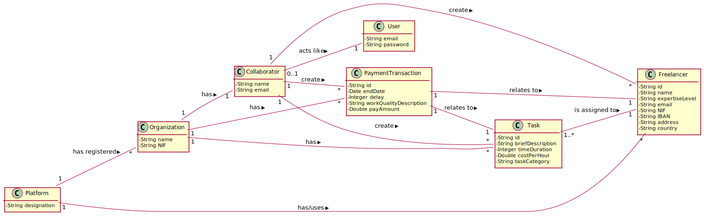
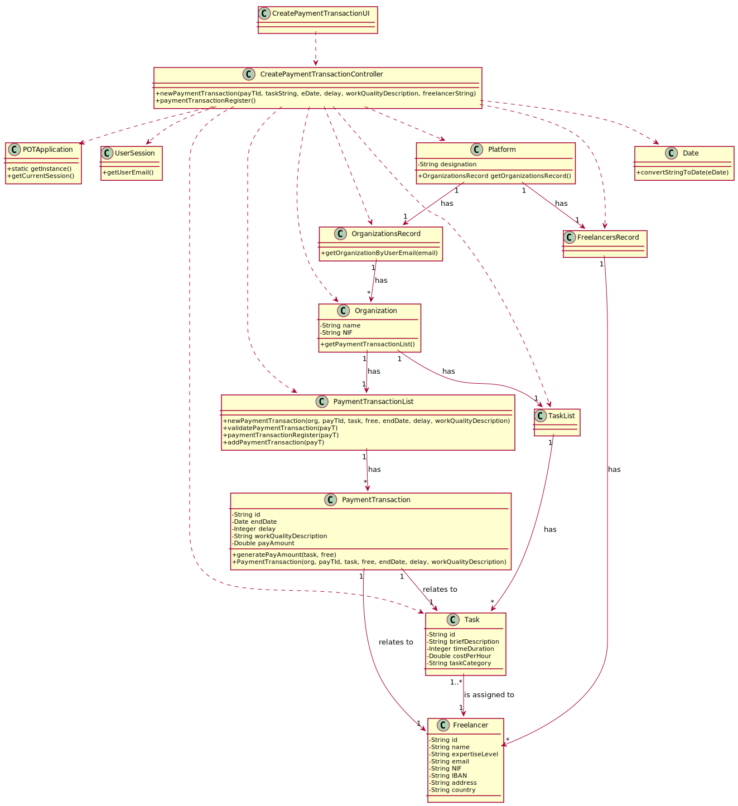

# UC3 - Create Payment Transaction

## 1. Requirements Engineering

### Brief Format

The organization's collaborator starts the creation of a payment transaction of a finished/executed task. The system requests the necessary data on the payment transaction, that is, a brief description of the task (taskId, brief description, time duration (in hours), cost per hour (in euros) and task category), details about the execution of the task (end date, delay, brief description of the quality of the work) and information about the freelancer that worked on the task (frlId, name, level of expertise, e-mail, NIF, bank account (IBAN), address and country). The organization's collaborator enters the requested data. The system validates and displays the payment transaction data and also the amount to pay to each freelancer, asking for confirmation. The organization's collaborator confirms. The system records the payment transaction data and informs the organization's collaborator of the success of the operation.

### SSD

### Complete Format

#### Main Actor

Organization's Collaborator

#### Interesting parts and their interesses
* **Organization's Collaborator:** intends to create payment transactions for Freelancers.
* **Freelancer:** wants a payment transaction to be created for himself.
* **T4J:** allows the organization's collaborator to create payment transactions for Freelancers.

#### Preconditions
n/a

#### Postconditions
The information about the payment transaction is saved in the system.

#### Main success scenario (or basic flow)

1. The organization's collaborator starts the creation of a payment transaction of a finished/executed task. 
2. The system requests the necessary data on the payment transaction, that is, a brief description of the task (taskId, brief description, time duration (in hours), cost per hour (in euros) and task category), details about the execution of the task (end date, delay, brief description of the quality of the work) and information about the freelancer that worked on the task (frlId, name, level of expertise, e-mail, NIF, bank account (IBAN), address and country). 
3. The organization's collaborator enters the requested data.
4. The system validates and displays the payment transaction data and also the amount to pay to each freelancer, asking for confirmation.
5. The organization's collaborator confirms.
6. The system records the payment transaction data and informs the organization's collaborator of the success of the operation. 

#### Extensions (or alternative flows)

*a. the organization's collaborator requests to cancel the creation of the payment transaction.

> The use case ends.

4a. Task description data incomplete.
>	1. The system informs which data is missing.
>	2. The system allows the entry of missing data (step 3)
>
	>	2a. The organization's collaborator does not change the data. The use case ends.

4b. Incomplete task execution details.
>	1. The system informs which data is missing.
>	2. The system allows the entry of missing data (step 3)
>
	>	2a. The organization's collaborator does not change the data. The use case ends.

4c. incomplete data about the freelancer who worked on the task.
>	1. The system informs which data is missing.
>	2. The system allows the entry of missing data (step 3)
>
	>	2a. The organization's collaborator does not change the data. The use case ends.
	
4d. Missing minimum required data.
>	1. The system informs which data is missing.
>	2. The system allows the entry of missing data (step 3)
>
	>	2a. The organization's collaborator does not change the data. The use case ends.

4c. The system detects that the data (or a subset of the data) entered does not exist in the system.
>	1. The system alerts the collaborator of the organization to the fact.
>	2. The system allows the creation of these missing data (transition to use cases 1 (create freelancer) and 2 (create task)).
>
	>	2a. the organization's collaborator does not create the data. The use case ends.

#### Special requirements
\-

#### List of Technologies and Data Variations
\-

#### Frequency of Occurrence
\-

#### Open questions

* Are there other data that are needed?
* Is all data mandatory?
* How often does this use case occur?

## 2. OO Analysis

### Excerpt from the Relevant Domain Model for UC

## 3. Design - Use Case Realization

### Rational

| Main Flow | Question: What Class ... | Answer  | Justification  |
|:--------------  |:---------------------- |:----------|:---------------------------- |
|1. The organization's collaborator starts the creation of a payment transaction of a finished/executed task.|... interact with the user?| CreatePaymentTransactionUI |Pure Fabrication|
| |... coordinates the UC?| CreatePaymentTransactionController|Controller|
| |... create PaymentTransaction instances?|Organization|Creator(rule 1)|
||... knows the user/collaborator using the system?|UserSession|IE: cf. user management component documentation.|
||... know which organization the user/collaborator belongs to?|OrganizationsRecord|IE: knows all organizations.|
|||Organization|IE: knows their collaborators.|
|||Collaborator|IE: knows his data (e.g. email). |
|2. The system requests the necessary data on the payment transaction, that is, a brief description of the task (taskId, brief description, time duration (in hours), cost per hour (in euros) and task category), details about the execution of the task (end date, delay, brief description of the quality of the work) and information about the freelancer that worked on the task (frlId, name, level of expertise, e-mail, NIF, bank account (IBAN), address and country).||||
|3. The organization's collaborator enters the requested data. |... save the data entered?|PaymentTransaction|IE: instance created in step 1|
|4. The system validates and displays the payment transaction data and also the amount to pay to each freelancer, asking for confirmation. |... checks if the data of the entered task exist?|Organization|IE: In MD, Organization has Task.|
|||TasksList|IE: In MD, Organization has Task. By application of HC+LC delegates the TasksList.|
||... checks if the data of the entered freelancer exist?|Platform|IE: In MD, Platform has/uses Freelancer.|
|||FreelancerRecord|IE: In MD, Platform has/uses Freelancer. By application of HC+LC delegates the FreelancersRecord.|
| |... validates payment transaction data (local validation)?|PaymentTransaction|IE: has its own data.|
| |... validates payment transaction data (global validation)?|Organization|IE: In MD, Organization has PaymentTransaction|
|5. The organization's collaborator confirms. ||||
|6. The system records the payment transaction data and informs the organization's collaborator of the success of the operation. |... saves the PaymentTransaction created?|Organization|IE: In MD, the Organization has PaymentTransaction.|
||informs the collaborator?|CreatePaymentTransactionUI||
         

### Systematization ##

It follows from the rational that the conceptual classes promoted to software classes are:

 * Platform
 * Organization
 * Collaborator
 * Task
 * Freelancer
 * PaymentTransaction

Other software classes (e.g. Pure Fabrication) identified:

 * CreatePaymentTransactionUI  
 * CreatePaymentTransactionController
 * OrganizationsRecord 
 * FreelancersRecord
 * TasksList

Other classes of external systems/components:

 * UserSession

###	Sequence Diagram

###	Class Diagram

