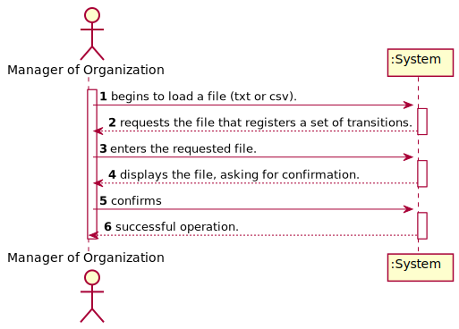
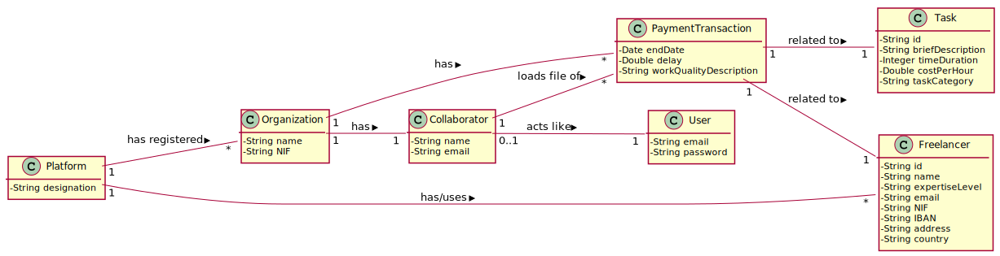
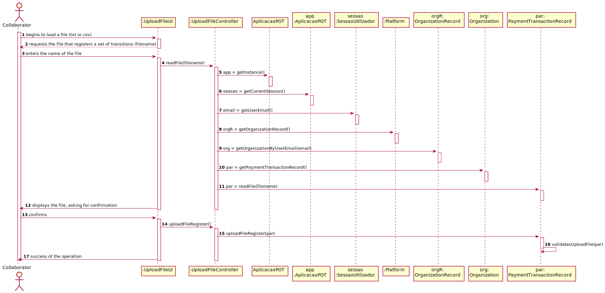
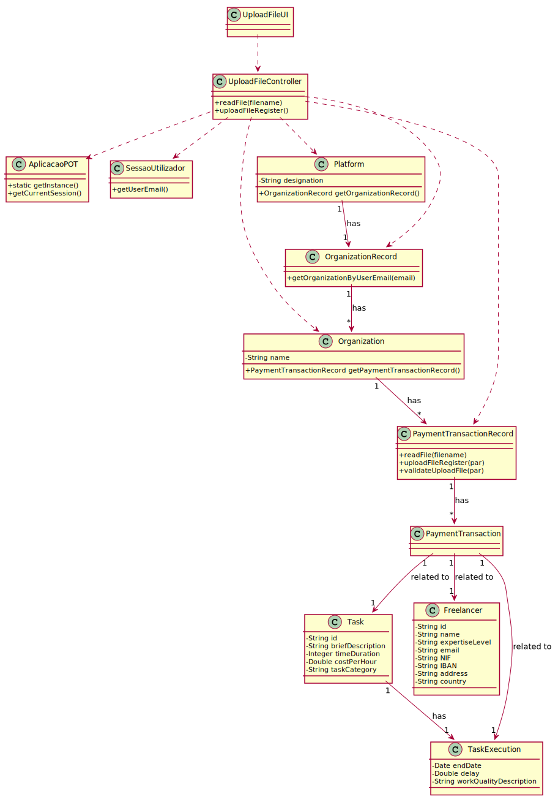

# UC4 - Upload File

## 1. Requirements Engineering

### Brief Format

The collaborator begins to load a file (txt or csv). The system requests the file that registers a set of transitions (filename). The collaborator enters the name of the file. The system validates and displays the file, asking for confirmation. The collaborator confirms. The system records the file and informs the manager of organization of the success of the operation.

### SSD

### Full Format

#### Main actor

Manager of Organization

#### Stakeholders and their interests
* **Collaborator:** intends to load a file that registers a set of transitions.
* **T4J:** wants the organization concerned to be able to view the uploaded file.

#### Preconditions
n/a

#### Postconditions
The file is read and the transaction information is available.

#### Main success scenario (or basic flow)

1. The collaborator begins to load a file (txt or csv). 
2. The system requests the file that registers a set of transitions (filename). 
3. The collaborator enters the name of the file.
4. The system validates and displays the file, asking for confirmation. 
5. The collaborator confirms. 
6. The system records the file and informs the collaborator of the success of the operation.

#### Extensions (or alternative flows)

*a. The collaborator requests to cancel the registration.

> The use case ends.
	
4a. Missing minimum required data.
>	1. The system informs which data is missing.
>	2. The system allows the entry of missing data (step 3)
>
	>	2a. The collaborator does not change the data. The use case ends.

4b. The system detects that the data (or a subset of the data) entered does not exist in the system.
>	1. The system alerts the manager of organization to the fact.
>	2. The system allows the creation of these missing data (step 3)
>
	>	2a. The collaborator does not change the data. The use case ends.

#### Special requirements
\-

#### List of Technologies and Data Variations
\-

#### Frequency of Occurrence
\-

#### Open questions

* Are there any other mandatory data in addition to those already known?
* How often does this use case occur?

## 2. OO Analysis

### Excerto do Modelo de Domínio Relevante para o UC

## 3. Design - Use Case Realization

### Racional

| Main Flow | Question: What Class ... | Answer  | Justification  |
|:--------------  |:---------------------- |:----------|:---------------------------- |
|1. The collaborator begins to load a file (txt or csv).|... interacts with the user?| UploadFileUI |Pure Fabrication|
| |... coordinates the UC?| UploadFileController |Controller|
| |... knows the user/manager using the system?|UserSession|IE: cf. user management component documentation.|
|2. The system requests the file that registers a set of transitions (filename).||||
|3. The collaborator enters the name of the file. |... saves the entered data?|PaymentTransactionRecord|IE: In MD, Organization has PaymentTransaction. By application of HC+LC delegates the PaymentTransactionRecord.|
|||PaymentTransactionRecord|IE: Knows his own information.|
|4. The system displays the file, asking for confirmation. ||||
|5. The collaborator confirms. ||||
|6. The system records the file and informs the manager of organization of the success of the operation.|... saves the information?| PaymentTransactionRecord |IE: In MD, Organization has PaymentTransaction. By application of HC+LC delegates the PaymentTransactionRecord.|
||...informs the manager?| UploadFileUI|Pure Fabrication|

             

### Systematization ##

 It follows from the rational that the conceptual classes promoted to software classes are:

 * Platform
 * Organization
 * PaymentTransactionRecord

Other software classes (i.e. Pure Fabrication) identified:  

 * UploadFileUI  
 * UploadFileController

###	Sequence Diagram

###	Class Diagram

