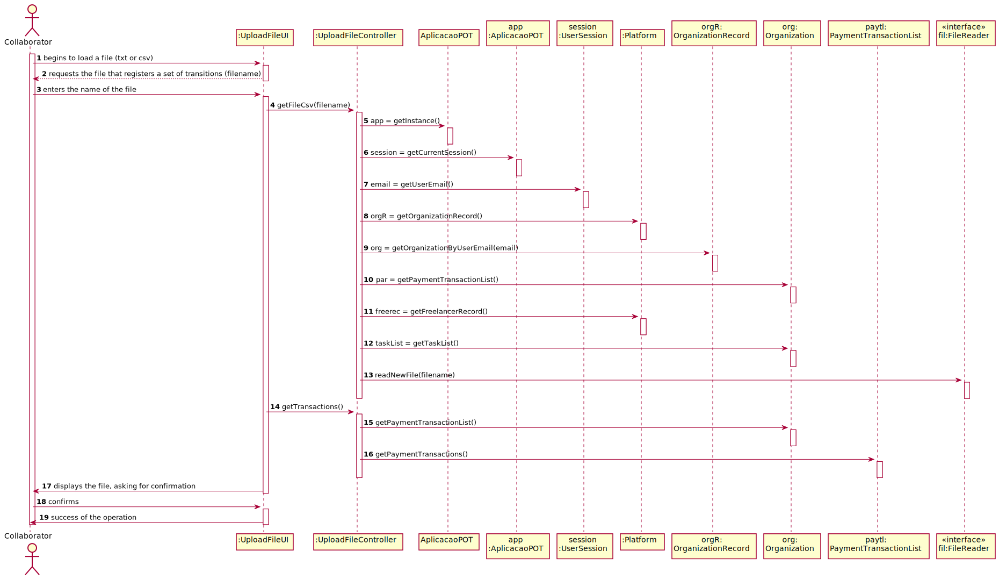

# UC4 - Upload File

## 1. Requirements Engineering

### Brief Format

The manager of organization begins to load a file (txt or csv). The system requests the file that registers a set of transitions. The manager of organization enters the requested file. The system validates and displays the file, asking for confirmation. The manager of organization confirms. The system records the file and informs the manager of organization of the success of the operation.

### SSD

### Full Format

#### Main actor

Manager of Organization

#### Stakeholders and their interests
* **Manager of Organization:** intends to load a file that registers a set of transitions.
* **T4J:** wants the organization concerned to be able to view the uploaded file.

#### Preconditions
n/a

#### Postconditions
The file is read and the transaction information is available.

#### Main success scenario (or basic flow)

1. The manager of organization begins to load a file (txt or csv). 
2. The system requests the file that registers a set of transitions. 
3. The manager of organization enters the requested file. 
4. The system validates and displays the file, asking for confirmation. 
5. The manager of organization confirms. 
6. The system records the file and informs the manager of organization of the success of the operation.

#### Extensions (or alternative flows)

*a. The manager of organization requests to cancel the registration.

> The use case ends.
	
4a. Missing minimum required data.
>	1. The system informs which data is missing.
>	2. The system allows the entry of missing data (step 3)
>
	>	2a. The manager of organization does not change the data. The use case ends.

4b. The system detects that the data (or a subset of the data) entered does not exist in the system.
>	1. The system alerts the manager of organization to the fact.
>	2. The system allows the creation of these missing data (step 3)
>
	>	2a. The manager of organization does not change the data. The use case ends.

#### Special requirements
\-

#### List of Technologies and Data Variations
\-

#### Frequency of Occurrence
\-

#### Open questions

* Are there any other mandatory data in addition to those already known?
* How often does this use case occur?

## 2. OO Analysis

### Excerto do Modelo de Domínio Relevante para o UC

## 3. Design - Use Case Realization

### Racional

| Main Flow | Question: What Class ... | Answer  | Justification  |
|:--------------  |:---------------------- |:----------|:---------------------------- |
|1. O utilizador não registado inicia o registo de uma organização.|... interage com o utilizador?| RegistarOrganizacaoUI |Pure Fabrication|
| |... coordena o UC?| RegistarOrganizacaoController |Controller|
| |... cria instâncias de Organizacao?|Plataforma|Creator(regra1)|
|2. O sistema solicita os dados necessários sobre a organização (i.e. nome da organização, o NIF, o endereço postal, um contacto telefónico, o endereço web, email) e sobre o colaborador (i.e. gestor) que está a proceder ao registo (i.e. nome, função, contacto telefónico, email e pwd).||||
|3. O utilizador não registado introduz os dados solicitados. |... guarda os dados introduzidos?|Organizacao, EnderecoPostal, Colaborador|IE: instância criada no passo 1|
| |... cria instâncias de EnderecoPostal?|Organizacao|creator(regra1)|
| |... cria instâncias de Colaborador?|Organizacao|creator(regra1)|
|4. O sistema valida e apresenta os dados, pedindo que os confirme. |... valida os dados da Organizacao (validação local)|Organizacao|IE: possui os seus próprios dados|
| |... valida os dados da Organizacao (validação local)|EnderecoPostal|IE: possui os seus próprios dados|
| |... valida os dados da Organizacao (validação local)|Colaborador|IE: possui os seus próprios dados|
| |... valida os dados da Organizacao (validação global)|Plataforma|IE: A Plataforma tem registadas Organizacao|
|5. O utilizador não registado confirma. ||||
|6. O sistema **regista os dados da organização e  do seu colaborador/gestor, tornando este último um utilizador registado** e informa o utilizador não registado do sucesso da operação.|... guarda a Organizacao criada?| Plataforma |IE: No MD a Plataforma tem  Organizacao|
| |... regista/guarda o Utilizador referente ao Colaborador da Organizacao?|AutorizacaoFacade|IE. A gestão de utilizadores é responsabilidade do componente externo respetivo cujo ponto de interação é através da classe "AutorizacaoFacade"|

             

### Systematization ##

 It follows from the rational that the conceptual classes promoted to software classes are:

 * Plataforma
 * Organizacao
 * Colaborador
 * EnderecoPostal

Other software classes (i.e. Pure Fabrication) identified:  

 * RegistarOrganizacaoUI  
 * RegistarOrganizacaoController

###	Sequence Diagram

###	Class Diagram

