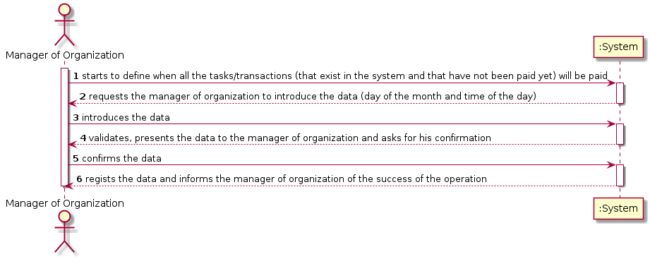

# UC 5 - Pay Automatically

## 1. Requirements Engineering

### Brief Format

The manager of organization starts to define when all the tasks/transactions, that exist in the system and that have not been paid yet, will be paid. The system requests the manager of organization to introduce the day of the month and the time of day. The manager of organization introduces the data. The system validates, presents the data to the manager of organization and asks for his confirmation. The manager of organization confirms the data. The system regists the data and informs the manager of the success of the operation.

### SSD

