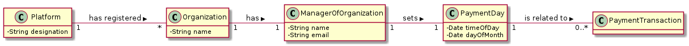
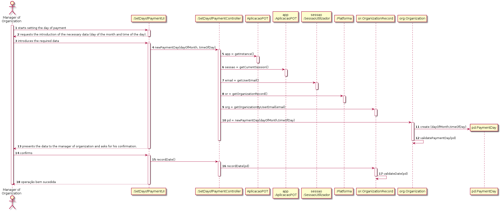

# UC 5 - Set Day of Payment

## 1. Requirements Engineering

### Brief Format

The manager of organization starts to define when all the tasks/transactions, that exist in the system and that have not been paid yet, will be paid. The system requests the manager of organization to introduce the day of the month and the time of day. The manager of organization introduces the data. The system validates, presents the data to the manager of organization and asks for his confirmation. The manager of organization confirms the data. The system regists the data and informs the manager of the success of the operation.

### SSD

### Full Format

#### Main Actor

* Manager of Organization

#### Interested parties and their interests

* **Manager of organization:** wants the system to be able to generate the payment to the freelancers.
* **Freelancer:** wants to be paid by their work.

#### Pre-Conditions

#### Post-Conditions

The payments will be made automatically by the system whenever we arrive to the time scheduled by the manager of the organization..

#### Main success scenario

1. The manager of organization starts defining when he wants all tasks/transactions to be paid automatically by the system.
2. The system requests the introduction of the necessary data (day of the month and time of the day).
3. The manager of organization introduces the required data.
4. The system validates, presents the data to the manager of organization and asks for his confirmation.
5. The manager of organization confirms the data.
6. The system regists the data and informs the manager of the success of the operation.

#### Extensions (or alternative flows)

*a. The manager of organization asks to cancel the data setting.

> The use case ends.

4a. Missing minimum required data.
>       1. The system informs which data is missing.
>       2. The system allows the introduction of missing data.
>
        >       2a. The manager or organization does not change the data. The use case ends.

4b. The system detects that the entered data (or some subset of the data) is invalid.
> 1. The system alerts the manager of organization to the fact.
> 2. The system allows its modification.
>
        > 2a. The manager of organization does not change tha data. The use case ends.

#### Special Requirements

#### List of Technologies and Data Variations
\-

####Frequency of Occurrence
\-

#### Open questions

## 2. OO Analysis

### Excerpt from the Domain Model relevant to the use case

## 3. Design - Use Case Realization

### Rational

| Main Flow | Question: What Class ... | Answer  | Justification  |
|:--------------  |:---------------------- |:----------|:---------------------------- |
|1. The manager of organization starts defining when he wants all tasks/transactions to be paid automatically by the system.|... interacts with the user?| SetDayOfPaymentUI |Pure Fabrication|
| |... coordinates the UC?| SetDayOfPaymentController |Controller|
| |... creates payment day instances?|Manager of organization|Creator(regra1)|
||... knows the manager of organization using the system?|UserSession|IE: cf. user management component documentation.|
||... knows which organization the manager belongs to?|OrganizationRecord|IE: knows all organizations.|
|2. The system requests the necessary data (day of the month and time of the day).||||
|3. The manager of organization introduces the required data. |... saves the introduced data?|PaymentDay|IE: instance created in step 1|
|4. The system validates, presents the data to the manager of organization and asks for his confirmation. ||||
|5. The manager of organization confirms the data.||||
|6. The system regists the data and informs the manager of the success of the operation.|... saves the AutomaticPayment created?| | |
| |... informs the manager of organization?|SetDayOfPaymentController||

### Systematization ##

It follows from the rational that the conceptual classes promoted to software classes are:

 * Platform
 * Organization
 * Manager of organization
 * PaymentDay

Other software classes (e.g. Pure Fabrication) identified:

 * SetDayOfPaymentUI
 * SetDayOfPaymentController
 * Organization record
 
Other classes of external systems/components:

  * UserSession

###	Sequence Diagram

###	Class Diagram

