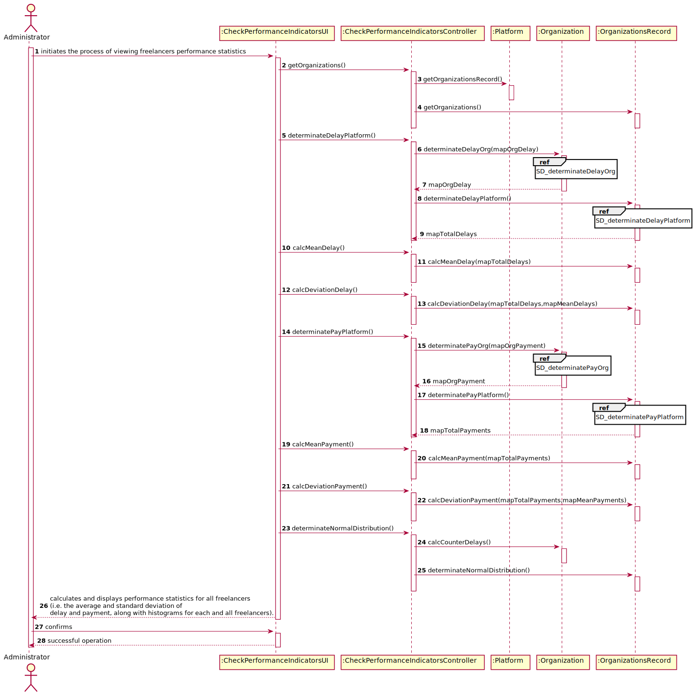
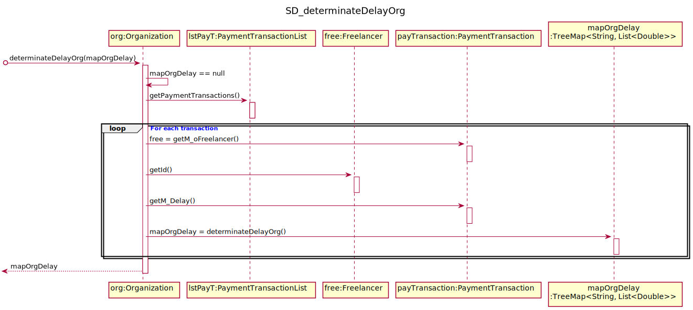
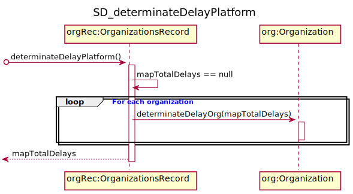
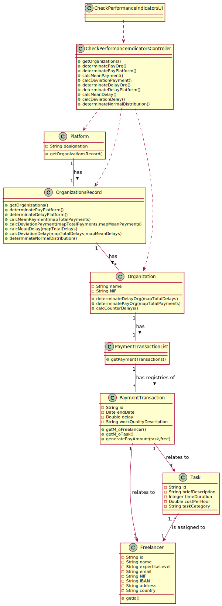

# UC6 - Check Performance Indicators

## 1. Requirements Engineering

### Brief Format

The administrator begins to analyze the statistics describing the performance of all freelancers. The system calculates and presents the statistics describing the performance of all freelancers and asks for confirmation. The administrator confirms. The system informs the administrator of the success of the operation.

### SSD

### Full Format

#### Main actor

Administrator

#### Stakeholders and their interests
* **Administrator:** intends to see statistics describing the performance of all freelancers.
* **T4J:** wants the administrator concerned to be able to the statistics of the freelancers registered in the system.

#### Preconditions
n/a

#### Postconditions
The T4J administrator is able to see statistics describing the performance of all freelancers.

#### Main success scenario (or basic flow)

1. The administrator begins to analyze the statistics describing the performance of all freelancers.
2. The system calculates and presents the statistics describing the performance of all freelancers and asks for confirmation.
3. The administrator confirms.
4. The system informs the administrator of the success of the operation.

#### Extensions (or alternative flows)

*a. The administrator requests to cancel the registration.

> The use case ends.
	
2a. Missing minimum required data to generate the histogram and present the mean and the standart deviation.
> 1. The system informs wich data is missing
>
	> 1a. The use case ends.

#### Special requirements
\-

#### List of Technologies and Data Variations
\-

#### Frequency of Occurrence
\-

#### Open questions

* Are there any other mandatory data in addition to those already known?
* How often does this use case occur?

## 2. OO Analysis

### Excerto do Modelo de Domínio Relevante para o UC

## 3. Design - Use Case Realization

### Racional

| Main Flow | Question: What Class ... | Answer  | Justification  |
|:--------------  |:---------------------- |:----------|:---------------------------- |
|1. The administrator begins to analyze the statistics describing the performance of all freelancers.|... interacts with the user?| CheckPerformanceIndicatorsUI |Pure Fabrication|
| |... coordinates the UC?| CheckPerformanceIndicatorsController |Controller|
| |... knows the user/administrator using the system?|UserSession|IE: cf. user management component documentation.|
|2. The system aks for one option (see the statistics of one freelancer or of all freelancers).||||
|3. The administrator chooses one option. ||||
|4. The system calculates and presents the statistics describing the performance of the freelancer and asks for confirmation.|...knows the statistics about task execution times ?|TaskExecution|IE:has it own data|
|5. The administrator confirms. ||||
|6. The system informs the administrator of the success of the operation.|...informs the administrator?|CheckPerformanceIndicatorsUI|Pure Fabrication|

             

### Systematization ##

 It follows from the rational that the conceptual classes promoted to software classes are:

 * Platform
 * Organization
 * PaymentTransactionRecord

Other software classes (i.e. Pure Fabrication) identified:  

 * CheckPerformanceIndicatorsUI  
 * CheckPerformanceIndicatorsController

###	Sequence Diagram

###	Class Diagram

