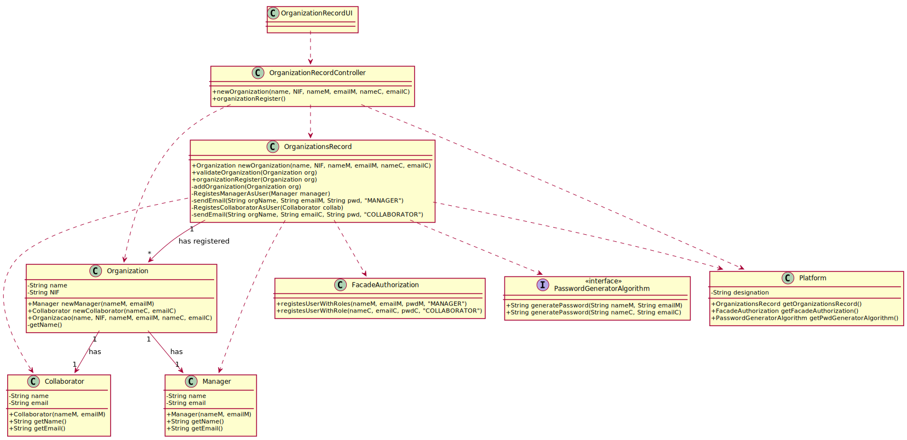

# UC7 - Add New Organization

## 1. Requirements Engineering

### Brief Format

The T4J administrator starts registering an organization. The system requests the necessary data about the organization (i.e. name of the organization), about the manager (i.e. name and email of the manager) and about the collaborator (i.e. name and email). The T4J administrator enters the requested data. The system validates and displays the data of the organization, its manager and its collaborator, asking for confirmation. The T4J administrator confirms. The system records the data of the organization, its manager and its collaborator, generating passwords for the latter and sending them by email, making them registered users and informs the T4J administrator of the success of the operation.

### SSD

### Complete Format

#### Main Actor

T4J administrator

#### Interesting parts and their interesses
* **T4J administrator:** intends to register the organization so that it can take advantage of the features provided by the platform.
* **T4J:** wants the organization concerned to register in order to use the platform.

#### Preconditions
n/a

#### Postconditions
* The organization's information is stored in the system.
* The manager's information is stored in the system.
* The collaborator's information is stored in the system.
* A user is created on the platform for the manager.
* An email is sent to the manager with information on accessing the platform.
* A user is created on the platform for the collaborator.
* An email is sent to the collaborator with information on accessing the platform.

#### Main success scenario (or basic flow)

1. The T4J administrator starts registering an organization. 
2. The system requests the necessary data about the organization (i.e. name of the organization), about the manager (i.e. name and email of the manager) and about the collaborator (i.e. name and email). 
3. The T4J administrator enters the requested data.
4. The system validates and displays the data of the organization, its manager and its collaborator, asking for confirmation.
5. The T4J administrator confirms.
6. The system records the data of the organization, its manager and its collaborator, generating passwords for the latter and sending them by email, making them registered users and informs the T4J administrator of the success of the operation.

#### Extensions (or alternative flows)

*a. The T4J administrator requests the cancellation of the organization's registration.

> The use case ends.
	
4a. Missing minimum required data.
>	1. The system informs which data is missing.
>	2. The system allows the entry of missing data (step 3)
>
	>	2a. The T4J administrator does not change the data. The use case ends.

4b. The system detects that the email of the manager or collaborrator entered must be unique and that it already exists in the system.
>	1. The system alerts the T4J administrator to the fact.
>	2. The system allows the entry of missing data (step 3)
>
	>	2a. The T4J administrator does not change the data. The use case ends.

#### Special requirements
\- The password of the manager and the collaborator are generated by an external algorithm.

#### List of Technologies and Data Variations
\-

#### Frequency of Occurrence
\-

#### Open questions

* Are there any other mandatory data in addition to those already known?
* Is there an additional security mechanism necessary to confirm that the organization exists?
* How often does this use case occur?

## 2. OO Analysis

### Excerpt from the Relevant Domain Model for UC

## 3. Design - Use Case Realization

### Rational

| Main Flow | Question: What Class ... | Answer  | Justification  |
|:--------------  |:---------------------- |:----------|:---------------------------- |
|1. The T4J administrator starts registering an organization. |... interact with the user?| OrganizationRecordUI |Pure Fabrication|
| |... coordinates the UC?| OrganizationRecordController |Controller|
| |... create Organization instances?|OrganizationsRecord|By the application of the Creator pattern (rule 1) it would be the "Platform". But, by applying HC + LC to the "Platform", this delegates that responsibility to the "OrganizationsRecord".|
|2. The system requests the necessary data about the organization (i.e. name of the organization), about the manager (i.e. name and email of the manager) and about the collaborator (i.e. name and email).||||
|3. The T4J administrator enters the requested data. |... save the data entered?|Organization,Collaborator|IE: instance created in step 1|
| |... create Collaborator instances?|Organization|creator(rule 1)|
|4. The system validates and displays the data of the organization, its manager and its collaborator, asking for confirmation. |... validates Organization data (local validation)?|Organization|IE: has its own data.|
| |... validates Collaborator data (local validation)?|Collaborator|IE: has its own data.|
| |... validates Organization data (global validation)?|OrganizationsRecord|IE: OrganizationsRecord has all organizations.|
|5. The T4J administrator confirms. ||||
|6. The system records the data of the organization, its manager and its collaborator, generating passwords for the latter and sending them by email, making them registered users and informs the T4J administrator of the success of the operation.|... saves the Organization created?| OrganizationsRecord |IE: By applying HC + LC to the Platform.|
| |... generates the password?|PassworddGeneratorAlgorithm|Protected Variation + Adapter|
| |... registers/keep the User related to the organization's manager and collaborator?|FacadeAuthorization|IE: User management is the responsibility of the respective external component whose point of interaction is through the class "FacadeAuthorization".|
| |...envia o email do gestor|OrganizationsRecord|IE: detem a informação necessária.|
||informs the T4J administrator?|OrganizationRecordUI||         

### Systematization ##

It follows from the rational that the conceptual classes promoted to software classes are:

 * Platform
 * Organization
 * Collaborator
 * PwdGeneratorAlgorithm

Other software classes (e.g. Pure Fabrication) identified:

 * OrganizationRecordUI  
 * OrganizationRecordController
 * FacadeAuthorization (from the user management component)
 * OrganizationsRecord

###	Sequence Diagram

###	Class Diagram

