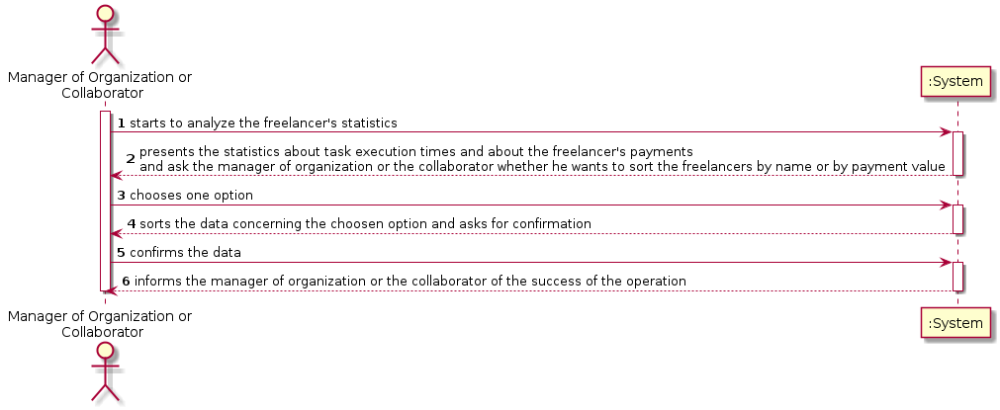

# UC 8 - Analyze Freelancer Statistics

## 1. Requirements Engineering

### Brief Format

The manager of organization or the collaborator starts to analyze the freelancers' statistics. The system presents the statistics about task execution times and about the freelancers' payments and ask the manager of organization or the collaborator whether he wants to sort the freelancers by name or by payment value. The manager of organization or the collaborator chooses one option. The system sorts the data according the option chosen, presents the data and asks for confirmation. The manager of organization or the collaborator confirms. The system informs of the success of the operation.

### SSD

### Full Format

#### Main Actor

* Manager of Organization

or

* Collaborator

#### Interested parties and their interests

* **Manager of organization or collaborator:** wants to see the statistics about the freelancers.
* **Platform:** wants to provide these informations to the organizations and their members.

#### Pre-Conditions

#### Post-Conditions

#### Main success scenario

1. Either the manager of organization or the collaborator starts to analyze the freelancer's statistics.
2. The system presents overall statistics about task execution times (the mean and the standard deviation of the delays, of each one and of all freelancers, a histogram to analyze the delays of each one and all the freelancers working to the organization) and freelancer payments (the mean and the standard deviation of the payments made to each one of the freelancers).
3(?). O sistema apresenta as hipóteses?
4. The manager of organization or the collaborator chooses how do he want to sort the freelancers' data (either by name or by payment value).
5. The system sorts the data according the option chosen, presents it and asks for confirmation.
6. Either the manager of organization or the collaborator confirms.
7. The system informs of the success of the operation.

#### Extensions (or alternative flows)

