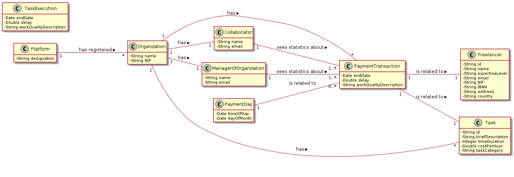
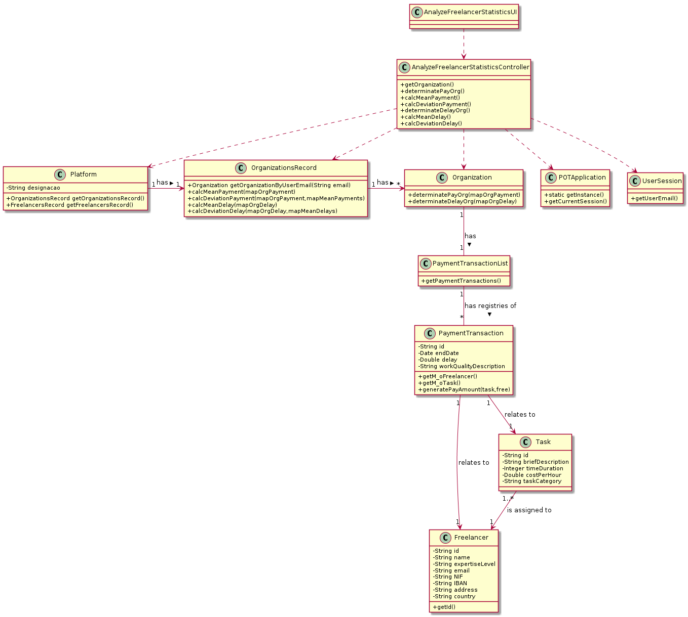

# UC 8 - Analyze Freelancer Statistics

## 1. Requirements Engineering

### Brief Format

The manager of organization or the collaborator starts to analyze the freelancers' statistics. The system presents the statistics about task execution times and about the freelancers' payments and ask the manager of organization or the collaborator whether he wants to sort the freelancers by name or by payment value. The manager of organization or the collaborator chooses one option. The system sorts the data according the option chosen, presents the data and asks for confirmation. The manager of organization or the collaborator confirms. The system informs of the success of the operation.

### SSD

### Full Format

#### Main Actor

* Manager of Organization

or

* Collaborator

#### Interested parties and their interests

* **Manager of organization or collaborator:** wants to see the statistics about the freelancers.
* **Platform:** wants to provide these informations to the organizations and their members.

#### Pre-Conditions

#### Post-Conditions

#### Main success scenario

1. Either the manager of organization or the collaborator starts to analyze the freelancer's statistics.
2. The system presents overall statistics about task execution times (the mean and the standard deviation of the delays, of each one and of all freelancers, a histogram to analyze the delays of each one and all the freelancers working to the organization) and freelancer payments (the mean and the standard deviation of the payments made to each one of the freelancers).
3. The system presents the ordering hypotheses.
4. The manager of organization or the collaborator chooses how do he want to sort the freelancers' data (either by name or by payment value).
5. The system sorts the data according the option chosen, presents it and asks for confirmation.
6. Either the manager of organization or the collaborator confirms.
7. The system informs of the success of the operation.

#### Extensions (or alternative flows)

*a. The manager of organization or the collaborator asks to cancel viewing the data.

> The use case ends.

4a. The manager of organization or the collaborator does not want to sort the data.

> The use case ends.

#### Special Requirements

#### List of Technologies and Data Variations
\-

####Frequency of Occurrence
\-

#### Open questions

## 2. OO Analysis

### Excerpt from the Domain Model relevant to the use case

## 3. Design - Use Case Realization

### Rational

| Main Flow | Question: What Class ... | Answer  | Justification  |
|:--------------  |:---------------------- |:----------|:---------------------------- |
|1. Either the manager of organization or the collaborator starts to analyze the freelancer's statistics.|... interacts with the user?| AnalyzeFreelancerStatisticsUI |Pure Fabrication|
| |... coordinates the UC?| AnalyzeFreelancerStatisticsController |Controller|
||... knows the manager of organization/collaborator using the system?|UserSession|IE: cf. user management component documentation.|
||... knows which organization the manager/collaborator belongs to?|OrganizationRecord|IE: knows all organizations.|
|2. The system presents the statistics.|...knows the statistics about task execution times ?|TaskExecution|InformationExpert:has it own data|
||... knows the statistics about the freelancer payments?| | |
|3. The system asks the manager of organization or the collaborator how does he want to sort the data.||||
|4. Either the manager of organization or the collaborator chooses one option.|||
|5. The system presents the data.||||
|6. Either the manager of organization or the collaborator confirms the data.||||
|7. The system informs the manager or the collaborator of the success of the operation.||||

### Systematization ##

It follows from the rational that the conceptual classes promoted to software classes are:

Other software classes (e.g. Pure Fabrication) identified:

 * AnalyzeFreelancerStatisticsUI
 * AnalyzeFreelancerStatisticsController
 * OrganizationRecord

Other classes of external systems/components:

   * UserSession

###	Sequence Diagram

###	Class Diagram

