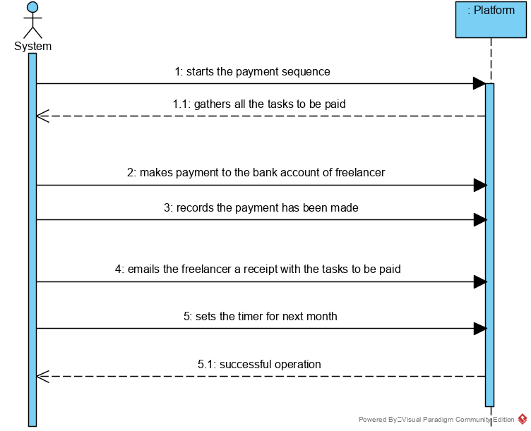

UC09 - Make Payments (Automatically)

## 1. Requirements engineering

### Brief Format

The System starts the payment sequence at the day of the month and time of the day previous set.
The System gathers all the tasks to be paid.
The System makes the payment to the bank account of the freelancer.
The System sends an e-mail to the freelancer with a receipt describing the amount to pay for each task and the overall payment value.
The system records that the payment has been made.
The System sets the timer for the next month.

### SSD

### Full Format

#### Main Actor

System

#### Interested Parts and their intentions
* **T4J:** wants to pay the freelancer for their tasks.
* **Freelancer:** wants to be paid for their tasks.

#### Pre conditions
/-

#### Post-conditions
The tasks are paid to the freelancer.
A timer is set to the next month.

### Success scenario  (or main flux)

1. The System starts the payment sequence at the day of the month and time of the day previous set.
2. The System gathers all the tasks to be paid.
3. The System makes the payment to the bank account of the freelancer.
4. The System sends an e-mail to the freelancer with a receipt describing the amount to pay for each task and the overall payment value.
5. The system records that the payment has been made.
6. The System sets the timer for the next month.

#### Extensions (or alternative fluxes)

*a. The System can not find the tasks to be paid.

> Use case ends.

4b. The systems detects that the information about the tasks of the Freelancer are incomplete.
>       1. The system alerts the collaborator for the fact.
>       2. The collaborator does not complete anything. The use case ends.

4c. The systems detects that the information about the tasks of the Freelancer are invalid.
>       1. The system alerts the collaborator for the fact.
>       2. The collaborator does not correct anything. The use case ends.

#### Special Requirements
\-

#### List of Technologies and Data Variations
\-

#### Frequency of Occurrence
\-

#### Open Questions

* How should the administrator be warned when the payment was not successful ?

## 2. OO Analysis

### Relevant section of MD to this UC

## 3. Design - Realization of Use Case

### Rational

| Main Flow | Question: Which class... | Answer | Justification |
|:--------------  |:---------------------- |:----------|:---------------------------- |
| 1. The System starts to payment of the Freelancer`s Tasks. |  |  |  |
|                                                        | ...coordinates the UC? | SetDayOfPaymentController | Controller |
|                                                        | ...knows TaskList? | Platform | HC+LC |
| 2. The system gets the list of Freelancers with payments.
| 4. For each Freelancer, the amount to be paid is calculated. | ...validates the information?(local)? | Controller  |  |  
|                                                                                                    | ...validates the information(global)? | TaskList | HC+LC |                                        
| 5. A e-mail is sent to the Freelancer with the amount to be paid. |  |  |  |
| 6. A order of payment is created to the IBAN of the Freelancer. | ...creates the order of payment? | PaymentTransaction | HC+LC: Platform delegated functions  |
| 7. A timer is set to next month.                                                                                                      | ...creates the timer? | SetDayOfPaymentController | Pure Fabrication |

### Systematization ##

 From the rational results the conceptual classes promoted to software classes are :

 * Platform
 * Task
 * Freelancer

 The other software classes (i.e. Pure Fabrication) identify:

 * SetDayOfPaymentController
 * TaskList

###     Sequence Diagram

###     Class Diagram

